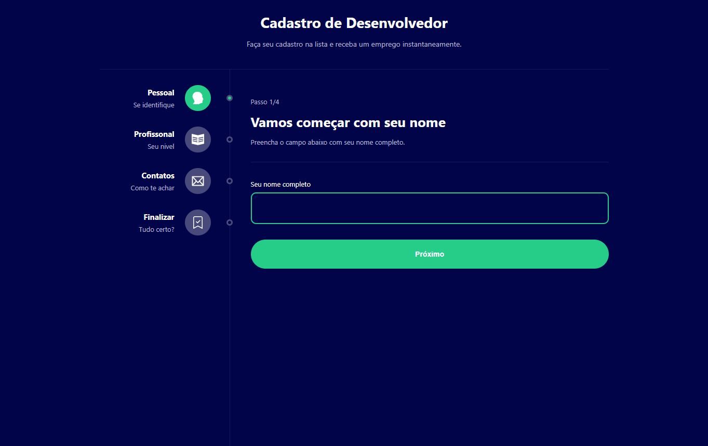
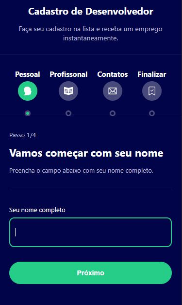

<h1 align="center">
  💻 Projeto
</h1>
<h4 align="center">
  Projeto criado para praticar e elevar conhecimentos e padrões de Desenvolvimento Front-end.
</h4>

## 🔎Preview

 <b>Link do Site:</b> <a target="_blank" href='https://funny-rugelach-cba6d7.netlify.app/'>MultiForm</a>

<h5 align="center">Desktop</h5>

<h5 align="center">Mobile</h5>

---

## 💼 Tecnologias utilizadas

Para o desenvolvimento deste site utilizei as seguintes tecnologias:

- HTML;

- Styled-components;

- React Router Dom

- TypeScript;

- React.js

  - useState
  - useEffect
  - useReduce
  - Context API
  
  

---

## 📋 Descrição

A ideia do site é ter um projeto de Formulario de cadastro para desenvolvedores, com quatro passos.

O projeto visa integrar os quatro passos com o router e o Context API, trazendo um contexto global com as informações que seram preenchidas no processo, para tornar a validadeção e a interface dinamica.

---

## ▶Execução

Comandos necessários:

**npm install:** Baixa os pacotes necessários para executar o projeto. 

**npm run dev:** Sobe o projeto;

